# Arquitetura do Pipeline — Real-Time Meeting Translator

Diagrama de fluxo dos dados desde a captura até a reprodução traduzida.
Foco em **o que acontece com o dado** e **onde cada coisa roda**
(CPU / GPU CUDA / subprocess Python / RAM). Configurações específicas
(thresholds, intervalos, tamanhos de buffer) estão fora — vivem nos
ADRs e no código.

## Fluxo de dados (com hardware)

Legenda dos badges:
- 🟦 **CPU** — Rust nativo ou ONNX/CPU
- 🟥 **GPU/CUDA** — kernel CUDA (PyTorch / llama-cpp / whisper.cpp)
- 🐍 **PY** — subprocess Python (bridge via stdin/stdout)
- 🟨 **RAM** — estado em memória compartilhada entre estágios
- 🎧 **IO** — driver de áudio (WASAPI)

```mermaid
flowchart TD
    classDef cpu fill:#1e3a5f,stroke:#4a90e2,color:#fff
    classDef gpu fill:#5f1e1e,stroke:#e24a4a,color:#fff
    classDef py fill:#3a2a5f,stroke:#9a7ae2,color:#fff
    classDef ram fill:#5f5f1e,stroke:#e2e24a,color:#fff
    classDef io fill:#3a3a3a,stroke:#aaa,color:#fff

    %% ─── INGRESSO ────────────────────────────────────────────
    INPUT["🎤 Mic + 🔊 Loopback<br/>PCM 16 kHz mono<br/><i>🎧 IO · WASAPI</i>"]:::io

    %% ─── DETECÇÃO DE FALA ───────────────────────────────────
    VAD["VAD<br/><i>fala? sim/não</i><br/><i>🟦 CPU · ONNX Silero</i>"]:::cpu

    %% ─── SEGMENTAÇÃO ────────────────────────────────────────
    SEG["Segmenter<br/><i>acumula PCM até<br/>fim de frase</i><br/><i>🟦 CPU · Rust</i>"]:::cpu

    %% ─── STT (DOIS CAMINHOS PARALELOS) ──────────────────────
    STT_S["STT streaming<br/><i>partial → texto incompleto</i><br/><i>🟥 GPU CUDA · whisper.cpp</i>"]:::gpu
    STT_F["STT final<br/><i>segmento fechado → texto autoritativo</i><br/><i>🟥 GPU CUDA · whisper.cpp</i>"]:::gpu

    LA2["Local Agreement<br/><i>prefixo estável entre partials</i><br/><i>🟦 CPU · Rust</i>"]:::cpu

    RECON["Reconciliação<br/><i>texto final − texto já comitado</i><br/><i>🟦 CPU · Rust</i>"]:::cpu

    %% ─── DIARIZAÇÃO (PARALELO AO STT FINAL) ─────────────────
    DIAR["Diariser<br/><i>quem está falando?</i><br/><i>🟦 CPU · SpeechBrain</i>"]:::cpu

    F0["F0 tracker<br/><i>frequência fundamental</i><br/><i>🟦 CPU · pyworld 🐍</i>"]:::py

    ENROLL["Auto-enrollment<br/><i>6 s de voz → WAV referência</i><br/><i>🟦 CPU · Rust + 🟨 RAM</i>"]:::ram

    %% ─── ACUMULADOR DE TEXTO ────────────────────────────────
    ACC["Accumulator<br/><i>junta texto até frase coerente<br/>+ associa speaker / voz</i><br/><i>🟦 CPU · Rust + 🟨 RAM</i>"]:::ram

    %% ─── TRADUÇÃO ───────────────────────────────────────────
    LLM["LLM tradutor<br/><i>en ↔ pt streaming de tokens</i><br/><i>🟥 GPU CUDA · Qwen 1.5B Q4 🐍</i>"]:::py

    DEDUP["Dedup<br/><i>frase repetida nos últimos 4 s?</i><br/><i>🟦 CPU · Rust + 🟨 RAM</i>"]:::ram

    %% ─── BACKPRESSURE ───────────────────────────────────────
    GATE["Backlog gate<br/><i>slot livre no TTS?<br/>sim → passa, não → espera ou dropa</i><br/><i>🟦 CPU · atomic counter</i>"]:::cpu

    %% ─── SÍNTESE DE VOZ ─────────────────────────────────────
    XTTS["TTS<br/><i>texto + voz referência → PCM stream</i><br/><i>🟥 GPU CUDA · XTTS-v2 🐍</i>"]:::py

    PREBUF["Pre-buffer<br/><i>segura primeiros chunks<br/>p/ evitar underrun</i><br/><i>🟦 CPU · Rust</i>"]:::cpu

    %% ─── PÓS-PROCESSAMENTO ──────────────────────────────────
    TCC["TCC<br/><i>refina timbre p/ bater com locutor<br/>(opcional, só em alguns chunks)</i><br/><i>🟥 GPU CUDA · OpenVoice 🐍</i>"]:::py

    FADE["Fade equal-power<br/><i>suaviza borda de phrase</i><br/><i>🟦 CPU · Rust</i>"]:::cpu

    RESAMPLE["Resampler<br/><i>24 kHz → taxa do device</i><br/><i>🟦 CPU · FFT stateful</i>"]:::cpu

    %% ─── MIXAGEM E SAÍDA ────────────────────────────────────
    MIX["Mixer<br/><i>soma TTS + passthrough<br/>com ducking</i><br/><i>🟦 CPU · Rust</i>"]:::cpu

    OUT["🔉 Output<br/>PCM → device de saída<br/><i>🎧 IO · WASAPI</i>"]:::io

    SUBS["💬 Subtitle overlay<br/><i>texto traduzido ao vivo</i><br/><i>🟦 CPU + GPU compositor</i>"]:::cpu

    %% ─── FLUXO PRINCIPAL ────────────────────────────────────
    INPUT -- "PCM" --> VAD
    VAD -- "PCM (só se fala)" --> SEG

    %% Dois caminhos saem do segmenter:
    SEG -- "buffer aberto<br/>(janela em curso)" --> STT_S
    SEG -- "segmento fechado<br/>(silence_tail OK)" --> STT_F
    SEG -- "segmento fechado<br/>(amostra de voz)" --> DIAR

    %% Streaming STT:
    STT_S -- "texto parcial" --> LA2
    LA2 -- "palavras estáveis" --> ACC

    %% STT final:
    STT_F -- "texto autoritativo" --> RECON
    LA2 -. "histórico" .-> RECON
    RECON -- "sufixo não-comitado" --> ACC

    %% Diarização:
    DIAR -- "speaker_id" --> ENROLL
    DIAR -- "samples" --> F0
    F0 -- "Hz" --> ENROLL
    ENROLL -- "path do WAV<br/>de referência" --> ACC

    %% Tradução:
    ACC -- "frase + voz" --> LLM
    LLM -- "fragmento" --> SUBS
    LLM -- "frase completa" --> DEDUP
    DEDUP -- "única" --> GATE
    DEDUP -. "duplicada → drop" .-> X1[ ]:::cpu

    %% TTS:
    GATE -- "frase + ref" --> XTTS
    XTTS -- "chunks PCM<br/>(stream incremental)" --> PREBUF
    PREBUF -- "rajada<br/>(após N chunks)" --> TCC
    TCC --> FADE
    FADE --> RESAMPLE
    RESAMPLE --> MIX

    %% Passthrough do áudio original também passa pelo mixer
    INPUT -. "passthrough<br/>(áudio original do meeting)" .-> MIX
    MIX --> OUT
```

## Mapa de carga por hardware

| Recurso | Quem roda lá | Pressão típica |
|---|---|---|
| **GPU CUDA (RTX 3050 6GB)** | Whisper streaming + Whisper final + Qwen 1.5B + XTTS-v2 + (opcional) OpenVoice TCC | **Saturado em narração contínua.** XTTS sozinho consome ~1.8 GB VRAM + roda em RTF 1.5-2. Whisper streaming dispara a cada 600 ms. Os três competem por kernel CUDA. |
| **CPU** | VAD, Segmenter, Local Agreement, Reconciliação, Diariser (SpeechBrain), F0 (pyworld), Accumulator, Dedup, Backlog gate, Fade, Resampler, Mixer | Carga moderada distribuída — diariser é o mais pesado (ECAPA-TDNN). |
| **RAM** | VoiceProfileRegistry, Accumulator state, Dedup ring, Echo buffer | <100 MB total. |
| **Subprocessos Python** | stt_bridge, diarization_bridge, translation_bridge, xtts_bridge | 4 processos persistentes. Cada um ~200-800 MB RAM (modelos carregados). XTTS subprocess sozinho ~1.5 GB RAM + 1.8 GB VRAM. |
| **IO WASAPI** | Capture (Mic + Loopback) e Output | Driver Windows, latência ~10-20 ms ida-e-volta. |

## Foco: o que acontece DEPOIS da tradução

A legenda aparece quase instantânea (Qwen first-token ~80-150 ms), mas
o áudio chega 3-14 s depois. O gap é **inteiramente no trecho
post-translation**. Diagrama detalhado desse trecho com timings reais
medidos em 2026-05-12 (Speaker side, narração contínua):

```mermaid
flowchart LR
    classDef fast fill:#1e5f3a,stroke:#4ae290,color:#fff
    classDef wait fill:#5f5f1e,stroke:#e2e24a,color:#fff
    classDef slow fill:#5f1e1e,stroke:#e24a4a,color:#fff
    classDef io fill:#3a3a3a,stroke:#aaa,color:#fff

    QWEN["Qwen tradutor<br/>streaming tokens<br/><b>~80-150 ms first token</b>"]:::fast

    %% Trilha A: subtitle (rápida)
    subgraph SUBTRILHA["🟢 Trilha subtitle (visível imediato)"]
        FRAG_OUT["Fragment commit<br/>(vírgula/ponto)"]:::fast
        SUB_RENDER["💬 Overlay render<br/>(eframe)"]:::fast
    end

    %% Trilha B: áudio (lenta)
    subgraph AUDIOTRILHA["🔴 Trilha áudio (gargalo)"]
        DEDUP["Dedup ring<br/>4 s window<br/><b>~0 ms</b>"]:::fast
        GATE["Backlog cap<br/>max 2 inflight<br/><b>0 - 5000 ms wait</b>"]:::wait
        COND["XTTS conditioning latents<br/>(novo speaker)<br/><b>~150-300 ms</b><br/>(0 ms se cached)"]:::wait
        FIRST["XTTS first chunk<br/><b>~600-900 ms</b>"]:::slow
        PREBUF["Pre-buffer 3 chunks<br/><b>~750 ms cushion</b>"]:::wait
        STREAM["XTTS chunks restantes<br/>~250 ms PCM cada<br/><b>RTF 1.5-2.2</b>"]:::slow
        TCC["TCC<br/>(boundary chunk)<br/><b>~50 ms</b>"]:::fast
        FADE["Fade equal-power<br/><b>&lt;1 ms</b>"]:::fast
        RESAMPLE["FFT resampler<br/>24→48 kHz<br/><b>~5 ms</b>"]:::fast
        MIXER["Mixer<br/><b>~10-20 ms</b>"]:::fast
        OUT["🔉 CPAL output"]:::io
    end

    QWEN --> FRAG_OUT
    FRAG_OUT --> SUB_RENDER

    QWEN -- "frase completa<br/>(after is_final)" --> DEDUP
    DEDUP --> GATE
    GATE --> COND
    COND --> FIRST
    FIRST --> PREBUF
    PREBUF -- "rajada inicial" --> TCC
    STREAM -. "chunks subsequentes" .-> TCC
    TCC --> FADE
    FADE --> RESAMPLE
    RESAMPLE --> MIXER
    MIXER --> OUT
```

### Quem está consumindo o tempo (caso comum, narração contínua)

| Estágio | Tempo típico | % do gap |
|---|---|---|
| Backlog wait (XTTS slot ocupado) | 0 - 5 000 ms | varia muito |
| Conditioning latents (troca speaker) | 0 / 150-300 ms | 5-10 % |
| First chunk XTTS | 600-900 ms | 15-20 % |
| Pre-buffer 3 chunks | 750 ms | 15-20 % |
| Synth restante (RTF 1.5-2.2) | 2 000-12 000 ms | 50-70 % |
| TCC + fade + resample + mixer | ~70 ms | <2 % |

**Caso médio observado no log atual**: legenda em ~300 ms, áudio em
~3-6 s, gap de 2.5-6 s. **Caso pior** (RTF >2, queue saturada): áudio
em 11-14 s, gap de 10+ s.

### Onde dá pra mexer (sem trocar engine)

1. **Sincronizar a legenda com o áudio** (aproximação perceptual). A
   legenda hoje revela palavra-a-palavra na velocidade do Qwen. Se
   ela esperar o `tts_first_chunk` (~700 ms) e depois revelar
   palavras numa velocidade proporcional aos samples PCM que vão
   tocando, o usuário sente legenda e voz simultâneas. Custo:
   subtitle fica visualmente mais lenta, mas a "sensação de
   simultaneidade" é o que você descreveu como ideal.

2. **Acelerar mais o XTTS** (`speed=1.30` ou `1.35`). Cada +0.05
   tira ~4 % do tempo de síntese e ~4 % da duração do áudio gerado.
   Limite seguro ~1.4 (vogais começam a distorcer).

3. **Reduzir o pre-buffer** (`TTS_PRE_BUFFER_CHUNKS` 3 → 2 ou 1).
   Economiza 250-500 ms de latência inicial. Risco: underrun em
   phrases longas quando XTTS está em RTF >2 (caso `[xtts] WARNING:
   peak=0.0000` no log).

4. **Pular dedup ring** (já redundante com SBD em prática). Microsegundos,
   ganho marginal mas elimina ~uma decisão.

5. **Cache de conditioning latents permanente** (já cacheia mas só na
   sessão — `_LATENT_CACHE` no `xtts_bridge.py`). Não há benefício
   extra a não ser que persistisse cross-restart, o que pouco vale.

## Sua intuição sobre a camada VAD/Segmenter

Você apontou um ponto arquitetural real: hoje o **VAD detecta fala
chunk a chunk** e o **Segmenter usa apenas heurística temporal**
(`max_window`, `silence_tail`) pra decidir quando "fim de frase".
Resultado: cortes acontecem em **silêncio acústico**, não em
**fronteira semântica**. Frases tipo *"e duas e meio vezes a altura
da [pausa] Estátua da Liberdade"* são cortadas no meio quando o
falante respira.

A proposta que você fez — usar uma **lib que pontue se a frase tem
sentido completo antes de liberar** — é exatamente o que falta. Em
NLP isso é chamado de **segmentação semântica / sentence boundary
detection (SBD)**. Algumas opções:

1. **spaCy** com sentencizer multilíngue — rápido, CPU, decide
   "isto é uma frase completa?" via árvore de dependências. Custo:
   ~30-100 ms por chamada, roda em CPU, sem GPU.

2. **PySBD** (Pragmatic Sentence Boundary Disambiguation) — mais
   leve, regras + estatística, especializado em pt-BR e en. <10 ms.

3. **Pequeno classificador BERT-base** treinado em "completo?" —
   mais preciso mas precisa GPU; já temos disputa por VRAM, então
   provavelmente desbalanceia.

4. **Reutilizar o próprio Qwen como classifier** — perguntar antes
   de traduzir "este texto é uma frase completa? sim/não". Custo
   marginal porque o LLM já está aquecido. Mas adiciona ~80 ms de
   first-token cada checagem.

Eu acho que **opção 1 ou 2 é o caminho** se quisermos endereçar isso
— colocando a lib na frente do Accumulator: a frase só sai pra
tradução quando passa de "completa" segundo o SBD. O `MAX_HOLD`
continua como ceiling de segurança (se SBD nunca aprova, força flush).

Não vou implementar agora porque é mudança de design — vale ADR antes
e provavelmente combina com a Fase 1 (contexto histórico no Qwen,
que se beneficia de frases completas como input).

Quer que eu abra uma proposta de ADR pra isso?
